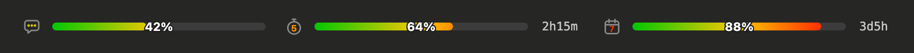
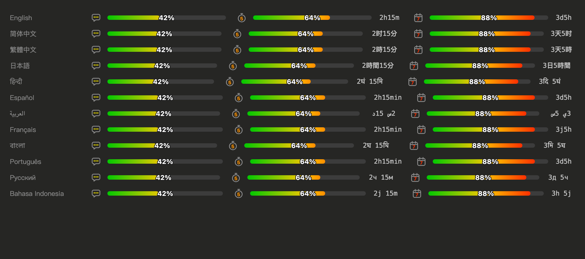

# claude-mod-usage

[English](../README.md) · [简体中文](README.zh-CN.md) · [繁體中文](README.zh-TW.md) · [日本語](README.ja.md) · [हिन्दी](README.hi.md) · [Español](README.es.md) · [العربية](README.ar.md) · [Français](README.fr.md) · [বাংলা](README.bn.md) · **Português** · [Русский](README.ru.md) · [Bahasa Indonesia](README.id.md)

Um Mod do Claude Code que mostra o seu uso do Claude em três barras de progresso com degradê, logo acima do prompt no **Claude Code Desktop** (e também no VS Code e no app para celular):

- **Contexto**: quanto da janela de contexto atual já está ocupado
- **Limite de 5 horas**: o uso da sua sessão, com o tempo restante até ser redefinido
- **Limite de 7 dias**: o seu uso semanal, com o tempo restante até ser redefinido



## Recursos

- Barras em degradê verde → amarelo → vermelho com pontas arredondadas; a cor de destaque do ícone também acompanha o uso
- A porcentagem fica no centro de cada barra, com contorno para continuar legível sobre qualquer cor
- Todas as barras têm o mesmo comprimento e a linha sempre ocupa toda a largura
- Contagem regressiva até a redefinição em fonte monoespaçada
- Atualiza após cada turno e sempre que um limite muda um ponto inteiro; a contagem regressiva avança a cada minuto
- 12 idiomas, detectados automaticamente
- Não mexe no terminal: a CLI já tem uma linha de status para isso
- Convive com outros mods acima do prompt: o que eles desenham ali fica empilhado abaixo das barras, sem ser encoberto



## Requisitos

- Claude Code com suporte a Mods (function hooks). Testado na versão 2.1.286. A API de Mods está em acesso antecipado e pode mudar.
- Uma assinatura do Claude. As barras "Limite de 5 horas" e "Limite de 7 dias" só aparecem quando o Claude Code informa os limites de uso; com uma chave de API, você vê apenas a barra "Contexto".

## Instalação

### Instalação rápida: deixe o Claude fazer

Copie este prompt e cole no Claude Code (Desktop, CLI ou VS Code). O Claude baixa o mod, atualiza suas configurações e as verifica:

```text
Instale o mod do Claude Code claude-mod-usage: clone https://github.com/jack21/claude-mod-usage em ~/.claude/mods/claude-mod-usage (se a pasta já existir, rode git pull nela). Depois adicione essa pasta a CLAUDE_CODE_PLUGIN_DIRS no bloco "env" de ~/.claude/settings.json, mantendo as pastas que já estiverem lá (separadas por ":" no macOS/Linux e ";" no Windows) e sem alterar nenhuma outra configuração. Confirme que o settings.json continua sendo um JSON válido, rode `claude plugin validate ~/.claude/mods/claude-mod-usage` e me diga para abrir uma nova sessão.
```

### Instalação manual

1. Baixe os arquivos:

   ```bash
   git clone https://github.com/jack21/claude-mod-usage ~/.claude/mods/claude-mod-usage
   ```

2. Faça o Claude Code carregá-lo. O Claude Code Desktop não aceita flags de linha de comando, então adicione a pasta ao bloco `env` de `~/.claude/settings.json`:

   ```json
   {
     "env": {
       "CLAUDE_CODE_PLUGIN_DIRS": "~/.claude/mods/claude-mod-usage"
     }
   }
   ```

   Para várias pastas, separe-as com `:` (macOS / Linux) ou `;` (Windows).

3. Inicie uma nova sessão. As barras aparecem após a primeira resposta.

Para testar uma única vez na CLI: `claude --plugin-dir ~/.claude/mods/claude-mod-usage`.

Opcional: adicione `"CLAUDE_CODE_PLUGIN_DIR_WATCH": "1"` ao mesmo bloco `env` para que o Desktop recarregue o mod quando você editar os arquivos dele.

## Idioma

O idioma de exibição é escolhido nesta ordem:

1. A opção **Language** no menu de configuração do plugin (`auto` por padrão)
2. A configuração `language` do próprio Claude Code (por exemplo, `"japanese"`, `"繁體中文"`)
3. `LC_ALL`, `LC_MESSAGES`, `LANG`
4. O idioma do sistema macOS (apps abertos pelo Dock geralmente não têm `LANG`)
5. Inglês

Para fixar um idioma sem usar o menu, adicione isto a `~/.claude/settings.json`:

```json
{
  "pluginConfigs": {
    "mod-usage": { "language": "ja" }
  }
}
```

Códigos suportados: `en`, `zh-CN`, `zh-TW`, `ja`, `hi`, `es`, `ar`, `fr`, `bn`, `pt`, `ru`, `id`.

## Como funciona

- `session.measure` envia os números de contexto e de limites de uso; `session.start` lê os valores atuais com `$.session.usage()`.
- As barras são desenhadas no slot `AbovePrompt` com elementos `Svg`. Um SVG exibido como imagem simples é esticado horizontalmente para preencher sua caixa, por isso cada barra é uma linha com pontas arredondadas e `vector-effect="non-scaling-stroke"`, o que mantém as pontas circulares em qualquer largura. O texto (porcentagem, contagem regressiva) é um SVG separado, de tamanho fixo, então nunca fica distorcido.
- O Desktop desenha os quadros SVG `isInteractive` sobre um fundo branco, por isso tudo aqui é desenhado como imagens simples.

## Desenvolvimento

```bash
claude plugin validate .   # checks the manifest and what the module hooks and calls
claude plugin test .       # runs tests/*.test.tsx against the engine
```

`hooks/register.tsx` é o módulo de hooks; `hooks/i18n.ts` contém as strings e as funções auxiliares de detecção de locale; `types/index.d.ts` é o contrato do estado.

Para adicionar um idioma: inclua o código dele em `types/index.d.ts` e `.claude-plugin/plugin.json`, as strings em `MESSAGES` e `SUPPORTED_LOCALES` no `hooks/i18n.ts`, e uma dica de nome em `LANGUAGE_NAME_HINTS`.

## Licença

[MIT](../LICENSE) © 2026 Jack Chiang
